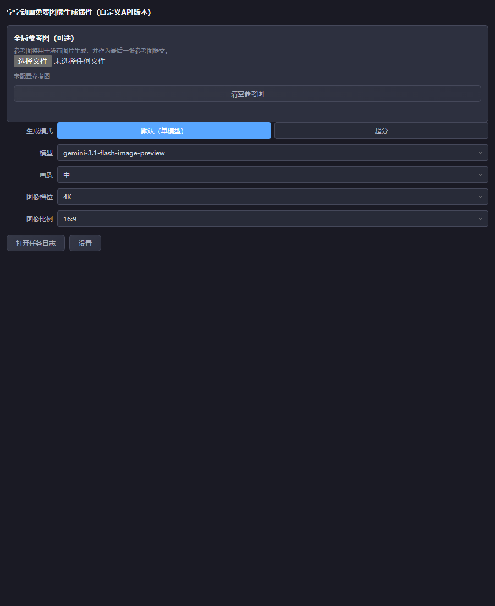
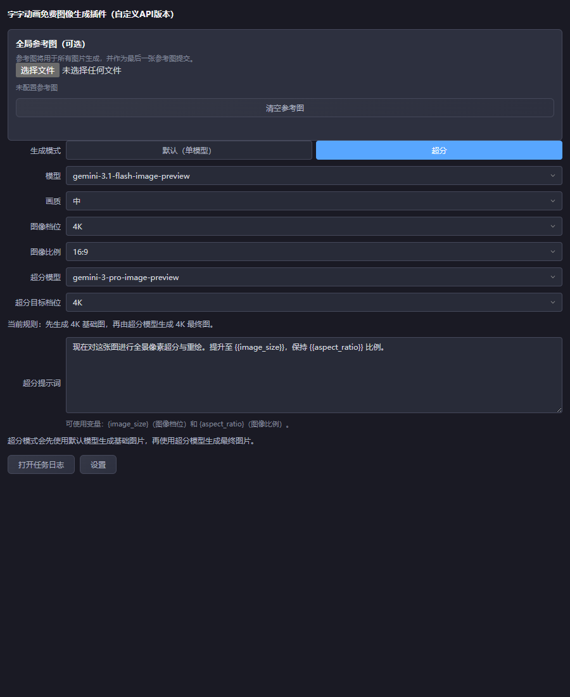
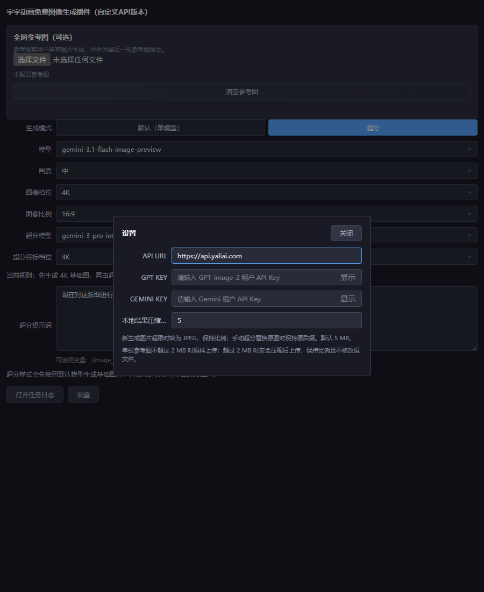
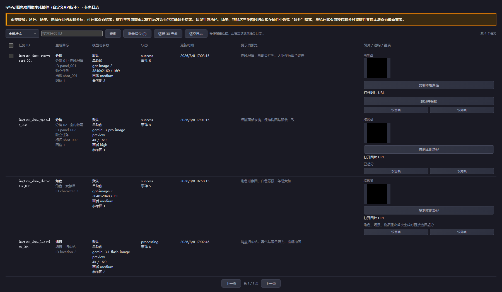

# 鸭梨AI图像生成插件（异步接口版）

这是一个面向 **字字动画** 的第三方免费图像生成插件。它接入字字动画的公开插件能力，将工具中的分镜、角色、场景和物品图像生成请求转发到鸭梨 AI 异步图像接口，并把生成结果交回字字动画使用。

本项目不是字字动画官方插件，不修改、注入或替换字字动画的官方代码和官方插件。用户只需要把本插件目录放入字字动画的图像插件目录，即可由宿主工具加载。

## 特色功能

- **异步生成与并发控制**：提交后立即保存任务 ID，批量任务并行执行，并根据本机带宽、内存和参考图处理压力限制活动任务数量。
- **多协议模型适配**：自动区分 OpenAI Images、Gemini、Grok 与 Agnes 请求结构，并按各自接口规则转换尺寸、比例和参考图字段。
- **Grok 与 Agnes 兼容接入**：支持 `grok-imagine-image-quality` 与 `agnes-image-2.1-flash`。Grok 使用 OpenAI Images 风格的 `generations/edits` 路径；Agnes 固定提交至其原生 `generations` 路径，并以 `size + ratio + extra_body.image` 表示参考图。
- **参考图顺序稳定**：兼容字字动画的角色、场景、物品、分镜关联图和插件全局参考图；全局参考图始终追加在最后，不打乱宿主已有顺序。
- **两阶段超分**：先生成基础图，再交给独立的超分模型生成最终图；支持继承原图比例、选择目标档位和自定义超分提示词。
- **结果交付与压缩**：生成结果按宿主资源路径处理，超大参考图和结果图按比例压缩，尽量保持宿主继续引用所需的路径与格式。
- **可追溯任务日志**：记录模式、模型、分辨率、画质、业务对象、任务状态和图片结果，便于定位分镜、角色、场景和物品的生成任务。

## 界面截图

以下截图来自本插件实际界面。任务日志截图中的任务、图片和 URL 均为脱敏示例，仅用于说明界面和操作位置。

### 默认单模型



### 超分模式

超分模式会先生成基础图，再调用超分模型生成最终图；只有最终结果交回字字动画。



### API 设置

API URL、各模型对应的 KEY 和本地图片压缩上限在独立设置弹窗中管理。



### 任务日志

任务日志可查看任务 ID、分镜或实体关联、模型与参数、状态、提示词预览、图片结果和超分操作。



## 主要功能

- 使用鸭梨 AI 异步接口生成图像，支持批量任务并行提交和本地并发约束。
- 支持 OpenAI Images 类型和 Gemini 类型模型，并分别使用对应的 API Key。
- 支持文生图和图生图；参考图可以来自字字动画关联的角色、场景、物品、分镜图片，也可以来自插件中的全局参考图。
- 参考图按宿主提供的顺序组装，全局参考图作为最后一张参考图追加，不改变宿主原有提示词和参考图顺序。
- 参考图超过配置大小时，在本地临时压缩后上传；原始参考图不会被插件直接改写。
- 支持“默认”和“超分”两种生成模式。超分模式先生成基础图，再将基础图交给超分模型，最终只返回超分结果。
- 超分模型按自身接口规则接收分辨率和比例，不会把 OpenAI 的像素尺寸直接错误提交给 Gemini。
- 任务日志显示任务状态、模型、生成模式、分辨率、画质、业务对象和结果图片，并支持从成功任务发起超分。
- 生成结果会按宿主资源路径规则处理，尽量保持宿主可继续引用的文件路径和格式。

## 适用场景

在字字动画中，本插件主要用于这些图像生成入口：

- 分镜生成图片
- 新建角色图片
- 新建场景图片
- 新建物品图片
- 对任务日志中的已完成分镜图片再次执行超分

角色、场景和物品在任务日志中执行后期超分时，任务日志可以查看超分结果，但宿主主界面可能需要重启字字动画后才重新加载最新实体图片。对于角色、场景和物品，建议在首次生成时直接选择“超分”模式。

## 安装

1. 关闭字字动画。
2. 将本项目的整个目录复制到字字动画的：

   ```text
   _internal/plugins/image_plugins/
   ```

3. 确认目录结构类似：

   ```text
   _internal/
   └─ plugins/
      └─ image_plugins/
         └─ yaliai-async-image-plugin/
            ├─ main.py
            ├─ index.html
            ├─ task_log.html
            ├─ 安装使用说明.txt
            └─ ui/
               ├─ index.html
               └─ task_log.html
   ```

4. 重新启动字字动画，在图像生成插件中打开“鸭梨AI图像生成插件（异步接口版）”。

不要只复制单个文件，也不要修改字字动画的官方插件文件。

## 首次配置

1. 在插件底部打开“设置”。
2. 按所选模型填写对应的 `GPT KEY`、`GEMINI KEY`、`GROK KEY` 或 `AGNES KEY`。
3. API URL 默认是：

   ```text
   https://api.yaliai.com
   ```

   如需使用其他兼容网关，可以在设置中修改。
4. 选择模型。模型所属接口类型由插件自动判断：
   - `gpt-image-2` 使用 OpenAI Images 接口。
   - `gemini-3.1-flash-image-preview`、`gemini-3-pro-image-preview` 使用 Gemini 接口。
   - `grok-imagine-image-quality` 使用 OpenAI Images 兼容路径，支持 1K/2K 与 Grok 合法比例，不提交 `quality`。
   - `agnes-image-2.1-flash` 固定使用 `/v1/images/generations`，支持 1K/2K/3K/4K 与 Agnes 合法比例；参考图按 `extra_body.image` 提交。
5. 保存设置后即可从字字动画的图像生成入口调用。

API Key 只保存在本机宿主用户资源目录，不写入项目源码。分发插件时不要把个人的 `config.json`、`async_tasks.jsonl` 或缓存目录一起打包。

## 插件更新

在插件底部打开“设置”，点击“检查更新”。更新清单固定从以下官方地址读取：

```text
https://api.yaliai.com/downloads/yaliai-async-image-plugin-update.json
```

清单至少需要包含：

```json
{
  "version": "3.4.4",
  "download_url": "https://api.yaliai.com/downloads/yaliai-async-image-plugin.zip",
  "sha256": "完整 ZIP 文件的 SHA-256",
  "notes": "更新说明"
}
```

插件仅接受 `api.yaliai.com` 的 HTTPS 更新包，且只接受严格高于当前版本的更新。下载完成后会校验 SHA-256、检查 ZIP 文件路径和必要文件，再替换插件代码。生成、下载、参考图处理或手动超分仍在执行时，插件会拒绝安装更新。更新过程不会覆盖本机 API Key、任务日志、参考图缓存；成功后需要重启字字动画。

## 生成模式

### 默认

只调用当前选择的模型，适合普通分镜、角色、场景和物品生成。

### 超分

按以下顺序执行：

1. 使用 A 模型生成基础图片。
2. 将基础图片保存到独立临时位置，必要时压缩后作为参考图提交给 B 模型。
3. 使用 B 模型和超分提示词生成最终图片。
4. 只把 B 阶段的最终结果交回字字动画，A 阶段图片仅作为中间结果。

B 模型默认是 `gemini-3-pro-image-preview`。A、B 的接口类型和 API Key 独立判断；分辨率、比例等语义设置会按照每个模型实际支持的字段分别转换。

超分提示词支持：

- `{image_size}`：当前图像档位，例如 `2K`、`4K`
- `{aspect_ratio}`：当前图像比例，例如 `16:9`

## 参考图

插件会接收字字动画传入的参考图，并在最终提交 API 前独立补全插件设置的全局参考图。全局参考图会追加为最后一张图片；未设置全局参考图时，文生图请求保持原有结构。

参考图上传前会在本地处理：小于或等于当前阈值的图片原样使用，超过阈值的图片按比例压缩到限制以内。压缩使用临时文件，不修改用户原始文件，并在任务结束后清理临时文件。

超分模式下，A 阶段生成的图片也会按同样的参考图处理规则进入 B 阶段。图片比例保持不变。

## 异步任务与任务日志

- 请求提交后立即关联并保存异步任务 ID。
- 首次查询会等待一段时间，避免在上游尚未完成时频繁查询；后续按固定间隔轮询。
- 每个模型阶段有独立等待预算，超分模式按两个阶段计算。
- 批量任务可以并行提交，但受插件本地并发、参考图处理和宿主资源约束，不会无限制地同时占用本机带宽与内存。
- 任务日志可以查看任务状态、模型、模式、档位、比例、画质、提示词预览、业务对象和图片结果。
- 任务日志中的分镜图片支持后期超分；角色、场景、物品后期超分后，主界面可能需要重启字字动画才能看到实体图片刷新结果。

## 数据与隐私

运行时数据位于字字动画用户资源目录下：

```text
user_resources/plugins/image_plugins/yaliai-async-image-plugin/
```

其中：

- `config.json`：本机配置和 API Key。
- `async_tasks.jsonl`：本机任务日志，不保存完整图片 Base64。
- `configured_references/`：插件设置的全局参考图临时副本。
- `task_thumbnails/`：任务日志使用的缩略图缓存。

请不要把包含 API Key、任务日志或个人图片的运行时目录提交到公开仓库。

## 开发与测试

项目使用 Python 和宿主提供的插件运行环境。源码测试可在项目目录执行：

```powershell
python -m unittest discover -v
```

测试覆盖异步提交与轮询、批量并发、OpenAI/Gemini 请求分支、参考图顺序、图片压缩、超分流程、任务日志和实体图片替换等关键业务路径。

## 兼容性说明

本插件依赖字字动画公开的第三方插件接口和宿主插件 SDK。它不会直接修改宿主的业务代码。角色、场景和物品的实体图片由宿主缓存和界面加载，任务日志中执行后期超分后，宿主主界面是否立即刷新取决于宿主是否提供对应的实体资源刷新能力；当前建议首次生成实体图片时直接使用超分模式。

## 许可证

本项目暂未附加开源许可证。公开仓库不等于自动授予复制、修改和再分发权；如需采用 MIT、Apache-2.0 或其他许可证，请在发布前明确选择并添加对应的 `LICENSE` 文件。
